# How to Get Started with EPIC Semantic Modeling

Note: This file was generated from some excellent documentation written by Dimitris Kiritsis while he was a graduate student at CMU. However, some of the functions documented may have changed slightly from the time this was written.

# Table of Contents

- [Project Structure](#project-structure)

- [Technology](#technology)

- [Recommended Reading](#recommended-reading)

- [Technical Documentation](#technical-documentation)

- [Project File Structure](#project-file-structure)

- [OpenADR : Generate Ontology Schema](#openadr--generate-ontology-schema)

- [Semantic XML](#semantic-xml)

- [OpenADR to EPIC Mapping](#openadr-to-epic-mapping)

  - [Namespace Functions](#namespace-functions)

  - [Post Mapping Fix](#post-mapping-fix)

  - [EPIC to OpenADR Mapping](#epic-to-openadr-mapping)

  - [PostReverseMappingFix](#postreversemappingfix)

- [SPARQLMotion Scripts](#sparqlmotion-scripts)

  - [triplestoreOperations:XMLInsert](#triplestoreoperationsxmlinsert)

  - [triplestoreOperations:SelectByEventID](#triplestoreoperationsselectbyeventid)

- [Postman Tool](#postman-tool)

- [References](#references)

# Project File Structure

- SemanticArchive, SemanticVocab: Archival and current (respectively) database directories, not intended for direct editing.

- SemanticModels

  - import: contains all External Ontology Schemata which are imported by and integrated with EPIC schema. 
    - import/OpenADR: Automatically Converted from XSD Schemas using TBCME's Import Tool.
  - schemas: contains the definitions of the core class and properties of the EPIC Information Model and helper extensions as well as integrations with the External Ontologies : BRICK, QUDT and SSN.
  - sparqlmotion: contains all scripts which define web service endpoints and enable the interaction with Topbraid’s Triple Store.
    - sparqlmotion/debug:  fully working parts of the production-ready triplestoreOperations.sms.ttl SPARQLMotion script - left to help future developers get accustomed and experiment with the basic flow of the underlying web services.
    - sparqlmotion/triplestoreOperations.sms.ttl: Definition of web-services : XMLInsert and SelectByEventID.
  - spin: contains RDF/SPIN files that define SPIN rules and SPINMap functions which are used during and after the mapping procedures
    - spin/namespace_functions.spin.ttl: a series of modified “buildURI”s spinmap:TargetFunctions for both mapping directions were constructed to facilitate and expedite the process of mapping.
    - spin/postMappingFix.spin.ttl: SPIN Rules that fire after the creation of EPIC Instances mapped from OpenADR.
    - spin/postReverseMappingFix.spin.ttl: SPIN Rules that fire after the creation of OpenADR Instances mapped from EPIC.
  - spinmap: contains SPINMap files which define rule-based mappings between EPIC and other Demand-Response Communication Protocols. Currently one OpenADR is supported.
    - mappings/oadr2epic.ttl: SPINMap definition for mapping OpenADR triples to EPIC triples.
    - mappings/epic2oadr.ttl: SPINMap definition for mapping EPIC triples to OpenADR triples.
  - vocab: contains all the instance vocabularies that refer to the EPIC schema.


# Technology

We used an Eclipse based semantic development environment called TopBraid Composer Maestro Edition (_TBC-ME_) from TopQuadrant. Version: 6.1 - JAVA version 1.8.0_121. This IDE allowed us to easily create SPARQLMotion scripts to define web service endpoints and interact with the Triple Store.


# Recommended Reading

Before starting working on Semantic Modeling, it is strongly recommended to review the material in the order listed below : 


1. Semantic Modeling and SPARQL 
    *   [Semantic Web for the Working Ontologist: Effective Modeling in RDFS and OWL](https://www.amazon.com/Semantic-Web-Working-Ontologist-Second/dp/0123859654/ref=pd_lpo_sbs_14_t_0?_encoding=UTF8&psc=1&refRID=TBTG5EVYBXYDKWWF5X6Y)
    *   [Learning SPARQL: Querying and Updating with SPARQL 1.1 ](https://www.amazon.com/Learning-SPARQL-Querying-Updating-1-1/dp/1449371434)
2. TopBraid Composer IDE
    *   [TopBraid Composer ™ Getting Started Guide Version 5.2 or later ](http://www.topquadrant.com/resources/products/docs/TBC-Getting-Started-Guide52.pdf)
    *   [TopBraid Composer : Features Overview](http://www.topquadrant.com/resources/knowledge-assets/docs/TBC_FeaturesOverview.pdf)
3. SPIN Rules and SPINMap 
    *   [Getting Started with SPARQL Rules (SPIN)](http://www.topquadrant.com/spin/tutorial/index.html)
    *   [Reshaping Relational Data using SPINMap](http://topquadrant.com/spin/SPINMapRDBMS/)
    *   [SPINMAP: SPARQL-BASED Ontology Mapping](http://www.topquadrant.com/2011/04/21/spinmap-sparql-based-ontology-mapping-with-a-graphical-notation/) 
    *   [SPINMap: SPARQL-based Ontology Mapping [Video]](https://vimeo.com/22695742) 
4. SPARQLMotion
    *   [SPARQLMotionTM Getting Started Guide](http://www.topquadrant.com/knowledge-assets/product-documentation/sparqlmotion-guide/)
    *   [SPARQLMotionTM Tutorial Version 4.1 or later](http://www.topquadrant.com/resources/products/docs/TBC-Getting-Started-Guide52.pdf)
    *   [Creating a Semantic Web Service in 5 Easy Steps](http://www.topquadrant.com/resources/knowledge-assets/docs/SemanticWebServices_in5steps_usingTopBraid.pdf)


# Technical Documentation

This section provides a technical overview of the project structure, OpenADR Schema Ontology conversion, SPINMap files, SPARQLMotion script implementation, script interaction, and generated output. The purpose of this section is to help future developers get started on the project.


## Project Structure

The high-level structure of the “**Semantic Models**” directory is presented below : 


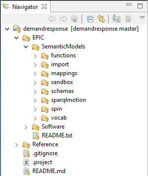


_Figure 1: EPIC Semantic Models  Project Structure_


*   The **functions** directory contains files which define “helper” functions specific to the EPIC project and assist in manipulating the properties of RDF Instances - For more details, refer to [Post Mapping Fix](#post-mapping-fix).
*   The **import** directory contains all External Ontology Schemata which are imported by and integrated with EPIC schema. For more details, refer to[ OpenADR : Generate Ontology Schema](#openadr--generate-ontology-schema).
*   The **mappings** directory contains SPINMap files which define rule-based mappings between EPIC and other Demand-Response Communication Protocols - Currently only OpenADR is supported. For more details, refer mainly to  [OpenADR to EPIC Mapping](#openadr-to-epic-mapping) and [Semantic XML](#semantic-xml).
*   The **sandbox** directory contains all files which are used during a Proof-of-Concept development procedure and should be removed on the production-ready version - Left as a convenient place for future developers to experiment safely with new features and ideas.
*   The **schemas** directory contains the definitions of the core class and properties of the EPIC Information Model and helper extensions as well as integrations with the following External Ontologies : BRICK, QUDT and SSN.
*   The **sparqlmotion** directory contains all scripts which define web service endpoints and enable the interaction with Topbraid’s Triple Store. The subdirectory **debug **contains fully working parts of the production-ready _triplestoreOperations.sms.ttl_ SPARQLMotion script and is left to help future developers get accustomed and experiment with the basic flow of the underlying web services. For more details, refer to [SPARQLMotion Scripts](#sparqlmotion-scripts).
*   The **spin** directory contains RDF/SPIN files that define SPIN rules and SPINMap functions which are used during and after the mapping procedure. For more details, refer to [Namespace Functions](#namespace-functions).
*   The **vocab** directory contains all the instance vocabularies that refer to the EPIC schema.


## OpenADR : Generate Ontology Schema

As defined in EPIC’s Technical Specification Document [2],  the Information Storage receives pricing and response events that are sent from the Utility using  the OpenADR model. 

Receiving incoming OpenADR messages from the grid involves several steps:


1.  Parsing the incoming XML message
2. Converting the XML into RDF triples according to the OpenADR schema
3. Transforming the OpenADR triples into EPIC triples
4.  Storing the EPIC triples in the triplestore

In order to be able to parse the incoming OpenADR XML message, then convert it to RDF triples compliant with the OpenADR Protocol, we must first define an Ontology Schema. We are able to automatically generate the OpenADR schema using the “Import XSD Schema Files” feature of TBC-ME. At this point it is strongly recommended to review the Import procedure described in TBC-ME Help > Import XSD and corresponding XML or or access this[ link](http://127.0.0.1:50475/help/ntopic/org.topbraidcomposer.core/html/Import_XSD.htm) while TBC-ME is running locally on your machine as well as this [Blog Post](http://www.topquadrant.com/2011/09/29/living-in-the-xml-and-owl-world-comprehensive-transformations-of-xml-schemas-and-xml-data-to-rdfowl/). The required XSD files can be found [here](https://drive.google.com/open?id=0BxxrPPAUmmuGU2ZoVU4tbXc0X2M).

It is important to select the last option “Use only XSD datatypes for datatype properties and literals”.

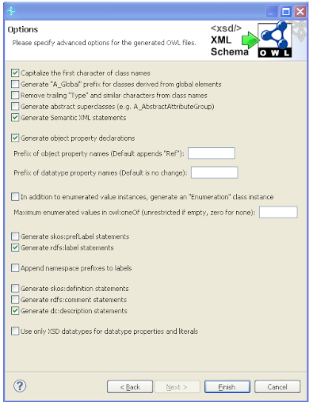


_Figure 2: Option Selection during “Import XSD Schema Files”_

By enabling the last option, TBC-ME Import Tool will automatically convert any ObjectProperty which actually refers to a xsd:Datatype and change it to the appropriate literal. 

After a successful conversion, you should see the following turtle (.ttl) files :  \


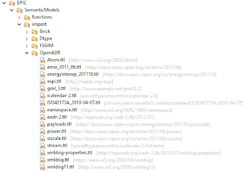


_Figure 3: OpenADR Ontology using “Import XSD Schema Files”_

At the time of this writing, an Issue has been discovered and reported to TopBraid’s Google Group concerning the case when the enclosing namespace of an XML element is different than the datatype namespace of its child. This issue is best illustrated through a simple example. Consider the following OpenADR XML message : 


```
<?xml version="1.0" encoding="UTF-8"?>
 <oadr:oadrDistributeEvent ei:schemaVersion="2.0b"   xsi:schemaLocation="http://openadr.org/oadr-2.0b/2012/07 oadr_20b.xsd"    xmlns:pyld="http://docs.oasis-open.org/ns/energyinterop/201110/payloads" xmlns:oadr="http://openadr.org/oadr-2.0b/2012/07"  >
	<pyld:requestID>REQ_12345</pyld:requestID>
</oadr:oadrDistributeEvent>
```


In this case, _oadr:oadrDistributeEvent_ has a nested 'child' Datatype element (_pyld:requestID_) which os defined in a different namespace (pyld - alt. payloads). Instead of attaching a Datatype property to the parent class, the Import Tool creates an owl:ObjectProperty in the namespace of the 'parent' that points to a Datatype Class in the child's namespace, as shown below : 


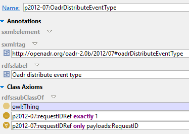


However, the _payloads:RequestID_ is not defined anywhere and as a result the RDF instances are not populated correctly. 


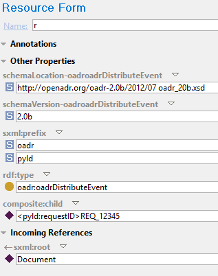


In the newly created instance of type _oadr:oadrDistributeEvent_, the Object property p2012-07:requestIDRef has not been populated. Instead, the nested <pyld:requestID> XML element has been mapped to an instance of class pyld:requestID which has been created on the fly by TBC-ME. 

As it has already been stated the problem arises because the Import Tool creates an owl:ObjectProperty in the namespace of the 'parent' that points to a Datatype Class in the child's namespace as shown in the Figure below : 


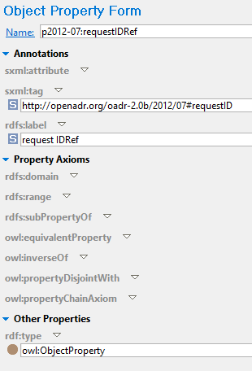


The solution to this issue is to manually hand-craft the appropriate Datatype properties in the child’s namespace - when they were originally defined by the XSD Schema File. In our example, we can solve the problem by creating the owl:DatatypeProperty payloads:requestID. It is vital to also transfer the sxml annotations to ensure that the round-tripping will be successful. The fix is presented in the following Figure.

<span style="text-decoration:underline;">NOTE</span> : An owl:ObjectProperty is annotated with an sxml:tag whereas an owl:DatatypeProperty is annotated with an sxml:attribute, reflecting the original XML structure.


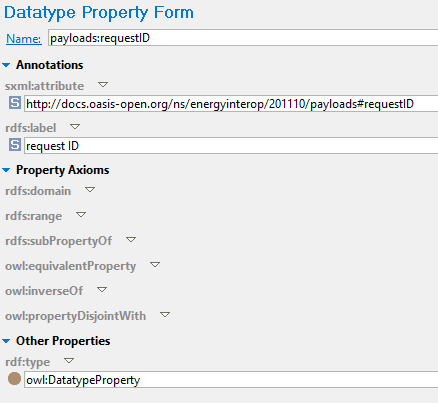


After we have defined the appropriate owl:DatatypeProperty in the child’s namespace and deleted the owl:ObjectProperty that has been incorrectly generated by TBC-ME, we have to also update the property definitions of the parent class as shown : 


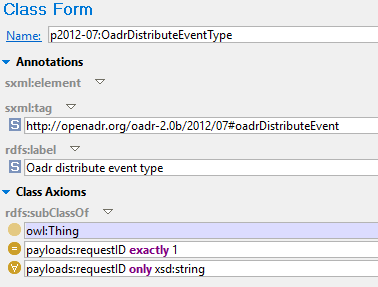


After applying the manual fix, we get the desired output as presented below : 


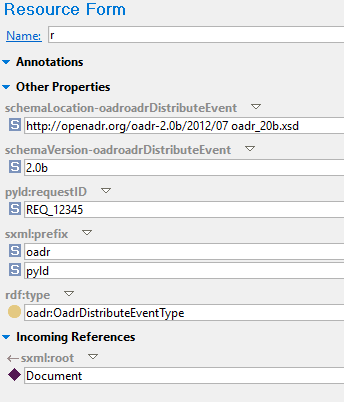


For any updates and a possible solution by TopQuadrant, please refer to the [GoogleGroup Thread](https://groups.google.com/d/topic/topbraid-users/IV79lazoDG8/discussion).


## Semantic XML

At this point, it is also recommended to review the Help>Creating, Importing, Querying, Saving XML documents with Semantic XML or access this[ link](http://localhost:50475/help/ntopic/org.topbraidcomposer.core/html/XMap.htm?resultof=%22semantic%22%20%22semant%22%20%22xml%22%20) while TBC-ME is running locally on your machine as well as watch this [Video-Tutorial](https://www.youtube.com/watch?v=_qHq3HcXHP4).  Semantic XML is a technology from TopQuadrant for mapping arbitrary XML documents to RDF. Semantic XML can be used to convert XML files to OWL so that you can run SPARQL queries,etc on them. You can also manipulate the resulting OWL model and then save it back to XML. In order to control the Semantic XML mappings, you can use process ontologies, which can usually be generated by importing them from XML Schemas. 

Semantic XML is based on a small ontology that defines various classes and attributes to enable round-tripping between XML and OWL. In particular it introduces two annotation properties sxml:element and sxml:attribute that are used to define the mapping. In our case, the process ontology is the converted OpenADR. The following mapping strategy will be applied (excerpt from TopBraid’s Documentation):


*   Each element instance will be mapped into an anonymous instance of an OWL class having the element name as an sxml:element or a sxml:tag property value.
*   Each attribute or child element with a simple type but no enumeration will be mapped into an OWL datatype property having the attribute or element name as an sxml:attribute property value. The attribute or child element instance value will be mapped into a typed literal, where the type is specified as the owl:allValuesFrom property value in a restriction on the OWL class of the mapped instance.
*   Each child element with a complex type will be mapped into an OWL object property having the element name as a sxml:tag property value. The element instance value will be mapped into an anonymous instance of the OWL class, which is specified as the owl:allValuesFrom property value in a restriction on the OWL class of the mapped parent instance.
*   Each attribute or child element with an enumeration type will be mapped into an OWL object property having the attribute or element name as a sxml:tag property value. The attribute or child element instance value will be mapped into an existing instance with the same dtype:value property value and has an OWL class, which is a subclass of an EnumeratedValue.
*   The ordering of child element instances are preserved either in composite:index property values of the mapped instances or sxml:order property values in the restrictions on properties related to the child element.
*   If a child element is defined in an XML Schema using a substitutionGroup, then it will be mapped into the OWL object property, which was derived from the substitutionGroup. However, the original type of the child element instance will still be used while mapping the instance itself.
*   If an element instance uses xsi:type, then the mapping from that type will override the default type.


## OpenADR to EPIC Mapping

This section describes the process of mapping OpenADR RDF triples to EPIC triples using a SPINMap specification file with Graphical Notation. Mapping is hard to do programmatically because the names of compatible properties are often quite different.  Examples of these mapping specifications . This mapping process not only creates new class instances according to the EPIC model, but also creates the relations between the newly created instances. A listing of all the OpenADR classes mapped to EPIC classes is shown in Figure 4 (20 mappings in total).

A new SPINMap file should be created for each generated JSON ontology using the following steps : 


*   Create a new SPINMap Mapping File.
*   Once the file is created, add the two ontologies to map. (e.g., OpenADR and EPIC, A and B, etc.)
*   Select a class from ontology “A” using the classes pane.
*   Select the “Diagram” tab at the bottom of the “Class Form”.
*   Find the equivalent class from ontology “B” using the classes pane and drag it into the diagram view.
*   Drag an arrow from the class name of ontology “A” to the class name of ontology “B”.
    *   Define a mapping between instance names in the resulting popup.
*   Drag arrows from the properties of ontology “A” to the the properties of ontology “B”.
    *   Define arbitrarily complex SPARQL mappings between properties in the resulting popups.


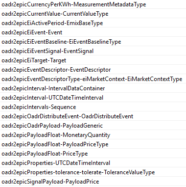


_Figure 4. Listing of the OpenADR classes mapped to EPIC classes_

Apart from the “Target Resource” SPINMap Target Function described in detail in [SPINMAP: SPARQL-BASED Ontology Mapping](http://www.topquadrant.com/2011/04/21/spinmap-sparql-based-ontology-mapping-with-a-graphical-notation/), another useful feature of SPINMap is the “Property Path Traversal”. It’s powerful capabilities are best shown through a simple example scenario (found under “sandbox” directory). 


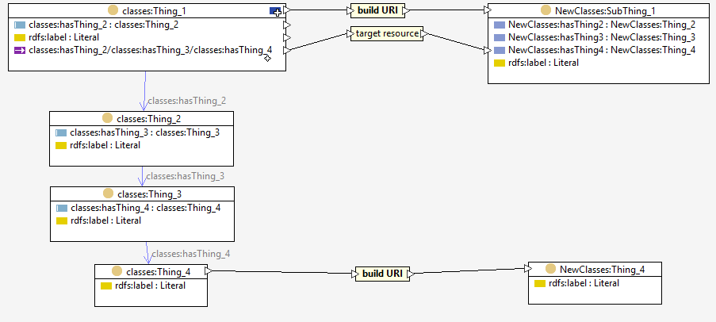


_Figure 5. Example Scenario to illustrate the Property Path Traversal Feature for SPINMap_

As depicted in Figure 5, in the “source” ontology class classes:Thing_1 has an ObjectProperty hasThing_2 that points to classes:Thing_2 which has an ObjectProperty hasThing_3 that points to classes:Thing_3 which has an ObjectProperty hasThing_4 that points to classes:Thing_4. However, in the “destination” ontology the definition of NewClasses:SubThing_1 has 3 different ObjectProperties that each one point to one of NewClasses:Thing_{2, 3, 4} respectively. In this situation, we cannot simply use the “Target Resource” SPINMap Target Function to map classes:Thing_4 to NewClasses:Thing_4 and attach it directly to NewClasses:SubThing_1 as classes:Thing_1 does not directly point to classes:Thing_4. To achieve this, we have to define the mappings between the source and destination classes and then use the “Property Path” traversal feature as described below: 


1. Click on the upper right arrow of the source class and drag the arrow to the corresponding ObjectProperty of the destination class. Selections are automatically colored in green as shown below.


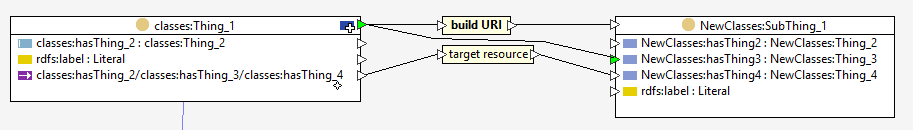


2. Define the property path (e.g. classes:hasThing_2/ classes:hasThing_3/ classes: hasThing_4) in the resulting popup as shown : 


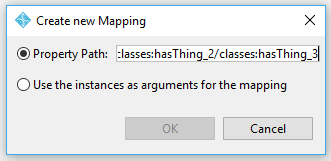


3. In the resulting pop-up window “Create Mapping Function”, first select “spinmap:targetResource” found under “spl:URIFunctions” of the  Navigation Panel. 


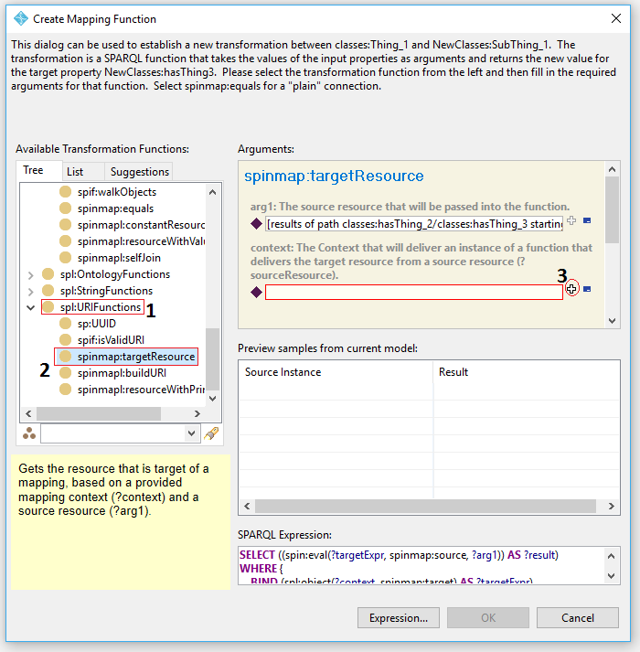


    Then, click on the “+” sign of the context.


1. In the resulting pop-up, select the appropriate mapping and click “OK”. <span style="text-decoration:underline;">NOTE</span>: The mapping relation between source and destination classes must be already defined prior to this procedure.


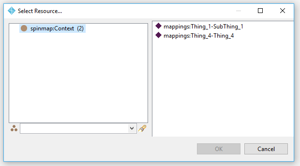


1. Finally, click “OK”. If successful, you should be able to see a Graphical notation similar to the image at Step 1.


### Namespace Functions

In order to be able to distinguish between instances of the same class, we used the convention of having unique namespaces (base URIs) among RDF triples that correspond to different OpenADR XML messages. To guarantee the uniqueness of each namespace, we append the timestamp of the arrival to the baseURI. When mapping to/from OpenADR from/to EPIC, we want to preserve the uniqueness of each baseURI. We achieve this by appending “_EPIC” to the baseURI of OpenADR triple when mapping from OpenADR to EPIC and by replacing “_EPIC” with “_OpenADR” when mapping from EPIC back to OpenADR. As a result, a series of modified “buildURI”s spinmap:TargetFunctions for both mapping directions were constructed to facilitate and expedite the process of mapping. A listing of the spinmap:TargetFunctions along with a brief description of their functionality and usage are shown in Table 1. For additional information regarding the underlying implementation, please refer to **/spin/namespace_functions.spin.ttl**.


<table>
  <tr>
   <td><p style="text-align: right">
<strong>build_EPIC_URI </strong></p>

   </td>
   <td>Appends the "_EPIC" string to the namespace prior to the "#" symbol.
<p>
 e.g. build_EPIC_URI(“test”) converts <http://example.com/demo#r> to <http://example.com/demo_EPIC#r>.
   </td>
  </tr>
  <tr>
   <td><p style="text-align: right">
<strong>build_EPIC_URI_1append </strong></p>

   </td>
   <td>Appends the "_EPIC" string to the namespace prior to the "#" symbol and then appends "_" followed by the string represented by ?arg1 at the end of the local name. 
<p>
e.g. build_EPIC_URI_1append(“test”) converts <http://example.com/demo#r> to <http://example.com/demo_EPIC#r_test>.
   </td>
  </tr>
  <tr>
   <td><p style="text-align: right">
<strong>build_EPIC_URI_1prop </strong></p>

   </td>
   <td>Appends the "_EPIC" string to the namespace prior to the "#" symbol and then appends the string value that property ?arg1 points to, at the end of the local name.
<p>
 e.g. build_EPIC_URI_1prop(hasValue) converts <http://example.com/demo#r> to <http://example.com/demo_EPIC#r_1> where ?source hasValue 1.
   </td>
  </tr>
  <tr>
   <td><p style="text-align: right">
<strong>build_EPIC_URI_2prop </strong></p>

   </td>
   <td>Appends the "_EPIC" string to the namespace prior to the "#" symbol. Then, performs a 2-depth property traversal identified by property ?arg1 and appends the string value that property ?arg2 points to at the end of the local name. 
<p>
 e.g. build_EPIC_URI_2prop(hasChild, hasValue) converts <http://example.com/demo#r> to <http://example.com/demo_EPIC#r_1> where ?source hasChild ?child and ?child hasValue 1 .
   </td>
  </tr>
  <tr>
   <td><p style="text-align: right">
<strong>modified_changeNamespace </strong></p>

   </td>
   <td>Replaces the "_EPIC" string with the string representation of ?arg1 
<p>
e.g.  modified_changeNamespace("OpenADR") converts <http://example.com/demo_EPIC#r> to <http://example.com/demo_OpenADR#r>.
   </td>
  </tr>
  <tr>
   <td><p style="text-align: right">
<strong>modified_buildURI_1 </strong></p>

   </td>
   <td>Replaces the "_EPIC" string with the string representation of ?arg1 and then replaces the qname with the string representation of ?arg2. 
<p>
e.g.  modified buildURI_1(“OpenADR”, “foo”) converts <http://example.com/demo_EPIC#r_test> to <http://example.com/demo_OpenADR#foo>.
   </td>
  </tr>
  <tr>
   <td><p style="text-align: right">
<strong>modified_buildURI_1append </strong></p>

   </td>
   <td>Replaces the "_EPIC" string with the string representation of ?arg1 and then appends  "_" followed by the string representation of ?arg2 at the end of the localname. 
<p>
e.g.  modified buildURI_1append(“OpenADR”, “foo”) converts <http://example.com/demo_EPIC#r> to <http://example.com/demo_OpenADR#r_foo>.
   </td>
  </tr>
  <tr>
   <td><p style="text-align: right">
<strong>modified_buildURI_2 </strong></p>

   </td>
   <td>Replaces the "_EPIC" string with the string representation of ?arg1. Then then appends  "_" followed by the string representation of ?arg2 at the end of the localname. Finally, appends "_"  followed by the string value that property ?arg3 points to, at the end of the localname.
<p>
e.g.  modified buildURI_2(“OpenADR”, “foo”, hasName) converts <http://example.com/demo_EPIC#r> to <http://example.com/demo_OpenADR#r_foo_bar> where ?source hasName "bar".
   </td>
  </tr>
</table>


_Table 1. Listing of custom-made spinmap:TargetFunctions used for mapping \
_


### Post Mapping Fix

In the case of Event Signals, the OpenADR Specification assumes that the Intervals which are included in a Sequence are consecutive, with no gaps nor overlaps and their sum of which must equal the full duration of the Active Period (For more details, refer to page 25 of [Profile Specification](https://drive.google.com/open?id=0ByHEprcY_BsMeUJtWlJDRUQtNW8)). As a result, the incoming XML message provides information only for the duration of each Interval along with its uid and does not explicitly state its dtStart. Therefore, based on the dtStart of the ActivePeriod and the pair <uid, duration> of each Interval we can calculate and populate the dtStart of the mapped epic:Intervals using SPIN rules. The file of interest is  **/spin/postMappingFix.spin.ttl**.


```
                 <strm:intervals>
                    	<ei:interval>
                       	 <xcal:duration>
                            	<xcal:duration>PT15M</xcal:duration>
                        	</xcal:duration>
                        	<xcal:uid>
                            	<xcal:text>0</xcal:text>
                        	</xcal:uid>
                        	<ei:signalPayload>
                            	<ei:payloadFloat>
                                	<ei:value>1.20</ei:value>
                            	</ei:payloadFloat>
                        	</ei:signalPayload>
                    	</ei:interval>
                    	<ei:interval>
                        	<xcal:duration>
                            	<xcal:duration>PT15M</xcal:duration>
                        	</xcal:duration>
    	                    <xcal:uid>
                            	<xcal:text>1</xcal:text>
                        	</xcal:uid>
                        	<ei:signalPayload>
                            	<ei:payloadFloat>
                           	     <ei:value>1.30</ei:value>
                            	</ei:payloadFloat>
                        	</ei:signalPayload>
                    	</ei:interval>
                	</strm:intervals>
```


_Figure 6. Excerpt of an OpenADR message illustrating Intervals of an Pricing Event

A SPIN Rule is attached to the _fsgim-sequence:IntervalDataContainer_ Class. The rule will fire iteratively for all Intervals in the Event Sequence. Using a “Property Path” traversal (in the reverse direction now, from child to parent), the rule first finds the dtStart time of the ActivePeriod which corresponds to the dtStart of the first Interval in the sequence (assuming it has uid = ‘0’ (zero)). For any consecutive Intervals which have not yet been assigned a dtStart, the rule calculates its dtStart via the function _efunc:calculateDtStart_. 


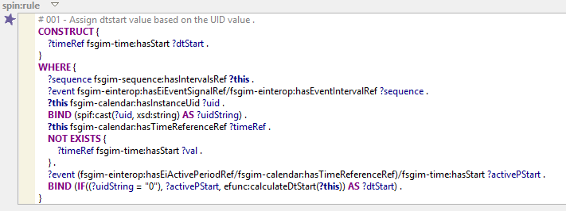


_Figure 7. SPIN rule attached to fsgim-sequence:IntervalDataContainer Class._

<span style="text-decoration:underline;">efunc:calculateDtStart: </span>Calculates the hasStart value for an interval that has UID greater than 0. This function depends on the OpenADR requirement that intervals within an Event have consecutive uid's, beginning with 0 (zero) (Figure 8).

arg1: the intervalDataContainer with a missing fsgim-time:hasStart property

Procedure:


1. Find the intervalDataContainer with UID one less than that of ?arg1
2. Add the start time and duration to compute the hasStart property for ?arg1


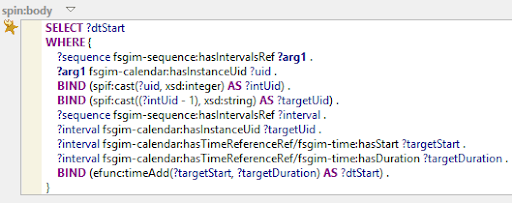


_Figure 8. Definition of Function efunc:calculateDtStart._

<span style="text-decoration:underline;">efunc:timeAdd : </span>Increment ?arg1 (UTCDateTime) by a value given by ?arg2 (duration)

Procedure:


1. Convert existing UTCDateTime and duration to milliseconds
2. Add the start time and duration to compute the hasStart property and return result as UTCDateTime


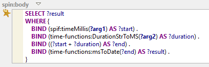


_Figure 9. Definition of Function efunc:timeAdd._

<span style="text-decoration:underline;">NOTE</span>: The function _time-functions:DurationStrToMS_ uses an external simple parser in JavaScript _(/functions/durationToSeconds.js_) which was created according to [iCalendar (RFC 5545)](https://icalendar.org/RFC-Specifications/iCalendar-RFC-5545/).


## EPIC to OpenADR Mapping

 

When mapping EPIC instances back to OpenADR, we followed the same approach as described in [OpenADR to EPIC Mapping](#openadr-to-epic-mapping).  A listing of all the EPIC classes mapped back to OpenADR classes is shown in Figure 10 (19 mappings in total). Both [Semantic XML](#semantic-xml) annotations and [Namespace Functions ](#namespace-functions)TargetFunctions proved to be of great assistance.


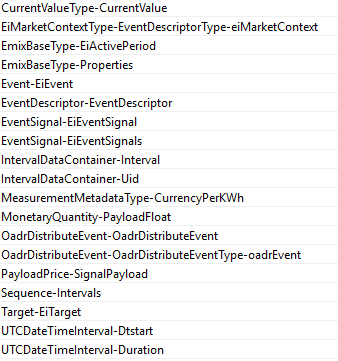


_Figure 10. Listing of the EPIC classes mapped to OpenADR classes_


### PostReverseMappingFix

As described earlier, Semantic XML introduces two annotation properties _sxml:element_ and _sxml:attribute_ that are used to define the mapping and to enable round-tripping between XML and OWL. When an incoming OpenADR XML message is converted to RDF, the resultant triples are instances of classes that have already been annotated and linked to an instance of the class _sxml:Document_ that basically enables the round-tripping between XML and OWL. However, when the OpenADR RDF triples are converted to EPIC triples, the Semantic XML annotations are not preserved neither the instance of the sxml:Document is mapped to any equivalent class as it is part of TopBraid’s ecosystem and not related to the EPIC schema. This creates a problem when mapping EPIC instances back to OpenADR aiming to reconstruct the incoming OpenADR XML message via Semantic XML. In order to overcome this issue, we have created a SPIN Rule that fires whenever an instance of a specific OpenADR Event  class is created as a result of mapping from EPIC. This rule - currently attached only to DistributeEvent class - creates the required sxml:Document instance and the appropriate property connections (in this case with the DistributeEvent object - Figure 11). 


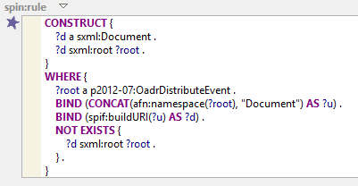
 

_Figure 11. SPIN rule to create the required sxml:Document instance_


## SPARQLMotion Scripts

This section describes the functionality and provides an overview of the Basic Flow of the webservice endpoints that were created to interact with the Triple Store.


### triplestoreOperations:XMLInsert

Receiving incoming OpenADR messages from the grid involves several steps :


1. Parsing the incoming XML message  
2. Converting the XML into RDF triples according to the OpenADR schema
3. Transforming the OpenADR triples into EPIC triples
4. Storing the EPIC triples in the triplestore

 


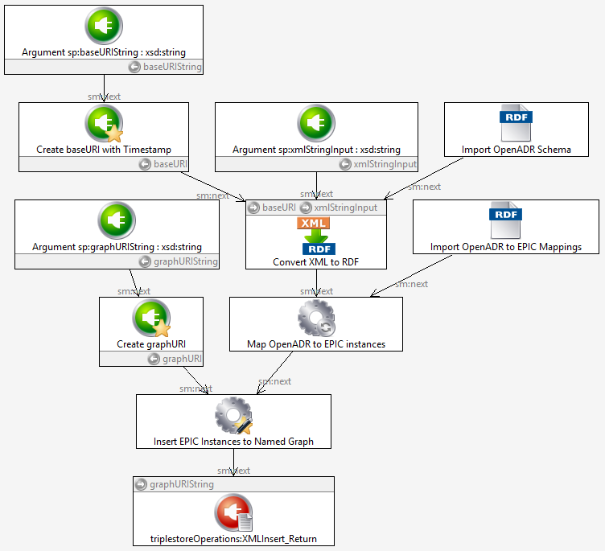


_Figure 12. SPARQLMotion script for receiving OpenADR XML messages_

As described in the Section Namespace Functions, in order to be able to distinguish between instances of the same class, we used the convention of having unique namespaces (base URIs) among RDF triples that correspond to different OpenADR XML messages. To guarantee the uniqueness of each namespace, we append the timestamp of the arrival to the baseURI.


Module “Create baseURI with Timestamp” creates the unique baseURI by appending the timestamp to the prefix URI specified by the user (_baseURIString_). 


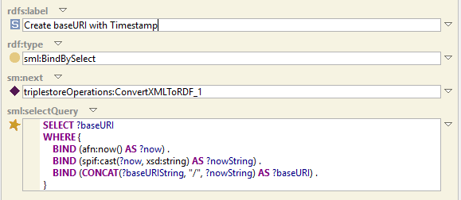


_Figure 13. Create unique namespace by appending timestamps_

The module labeled “ConvertOpenADRXMLToRDF” receives the XML message as a string (_xmlStringInput_) and interprets the string according to the OpenADR schema imported as oadr-2.ttl. 


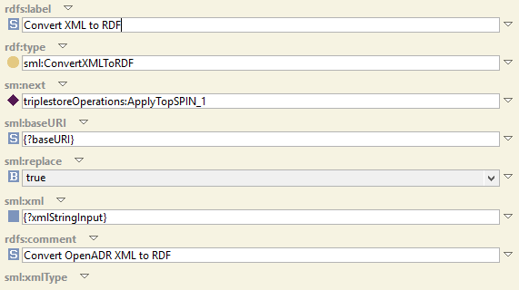


_Figure 14. Convert XML to RDF via Semantic XML annotations_


The RDF triples are then handed to the “Map OpenADR to EPIC instances” module that uses the oadr2epic.ttl SPINMap™ specification file to map the OpenADR triples to EPIC triples.(Fig. 15).


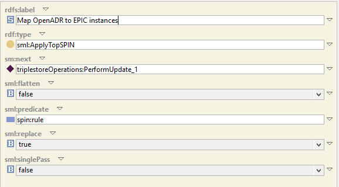


_Figure 15. Configuration Panel of TopSPIN Module_

The final step of the script involves inserting the newly defined instances into a named graph in our triplestore, which is accomplished using the “Update Named Graph” module, taking the name of the graph as an input argument (_graphURIString_). (Figure 16). \


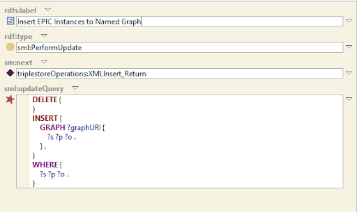


_Figure 16. Definition of Update  Query used to insert EPIC triples to named graph_


<table>
  <tr>
   <td colspan="2" ><strong>triplestoreOperations:XMLInsert</strong>
   </td>
  </tr>
  <tr>
   <td><p style="text-align: right">
<strong>Description</strong></p>

   </td>
   <td>Inserts an OpenADR XML file into the Triple Store as RDF Triples corresponding to the EPIC Schema.
   </td>
  </tr>
  <tr>
   <td><p style="text-align: right">
<strong>URL</strong></p>

   </td>
   <td>http://localhost:8083/tbl/sparqlmotion
   </td>
  </tr>
  <tr>
   <td><p style="text-align: right">
<strong>Method</strong></p>

   </td>
   <td>POST
   </td>
  </tr>
  <tr>
   <td><p style="text-align: right">
<strong>URL/ Data Parameters</strong></p>

   </td>
   <td><strong>Required:</strong>
<ul>

<li> id = triplestoreOperations:XMLInsert

<li> xmlStringInput = [the OpenADR XML represented as a String]

<p>
<strong>Optional:</strong>
<ul>

<li>graphURIString = [ the URI of the named graph represented as a String]

<li>default value = http://siemens.com/vocab/kps/epic_instances
<p>

    NOTE : the URI and corresponding file must be already defined
<ul>

<li> baseURIString = [ the partial URI that will be created for the EPIC RDF triples represented as a String]
<p>

    default value = http://siemens.com/test
</li>
</ul>
</li>
</ul>
</li>
</ul>
   </td>
  </tr>
  <tr>
   <td><p style="text-align: right">
<strong>Success Response</strong></p>

   </td>
   <td>Code: 200 OK
<p>
Content: The XML has been converted and mapped to EPIC RDF Triples into the graph: http://siemens.com/vocab/kps/epic_instances .
   </td>
  </tr>
  <tr>
   <td><p style="text-align: right">
<strong>Error Response</strong></p>

   </td>
   <td>Code: 500
<p>
Content: internal error has been reported by the SPARQLMotion engine of TopBraid Live Summary and Details shown
   </td>
  </tr>
  <tr>
   <td><p style="text-align: right">
<strong>Sample Call</strong></p>

   </td>
   <td>curl -X POST \
<p>
  http://localhost:8083/tbl/sparqlmotion \
<p>
  -H 'cache-control: no-cache' \
<p>
  -H 'content-type: application/x-www-form-urlencoded' \
<p>
  -d 'id=triplestoreOperations%3AXMLInsert&xmlStringInput= [encoded version of OpenADR message]
<p>
 
<p>
A fully functional example can be found<a href="https://drive.google.com/open?id=0BxxrPPAUmmuGNlFiMVZqMjJQczg"> here</a>
<p>
 
   </td>
  </tr>
</table>


### triplestoreOperations:SelectByEventID 

Generating messages in any desired format, including OpenADR encoded as XML, is more or less a matter of doing the previous steps in reverse. Specifically:


1. Retrieving the desired triples from the triplestore.
2. Transforming the EPIC triples into the triples consistent with a target schema, such as OpenADR.
3. Converting the triples into the desired encoding, such as XML.
4. Sending the resulting encoded message.


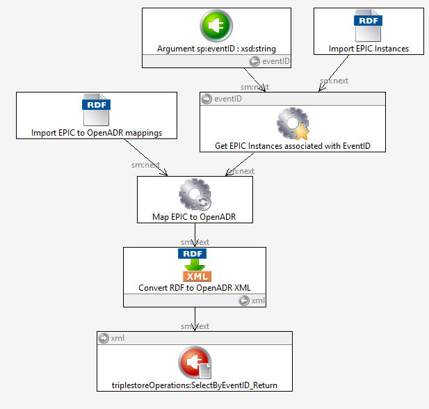
 \
_Figure 17. SPARQLMotion script for reconstructing OpenADR XML messages_

 \
Module “Get EPIC Instances associated with EventID” performs a SPARQL CONSTRUCT (equivalent to an SQL SELECT) call to retrieve the triples associated with an EventID specified as an input argument. Note that using this approach it will be just as easy to generate XML-encoded OpenADR as it is to generate data according to any other schema, provided that schema definition file is available in OWL.


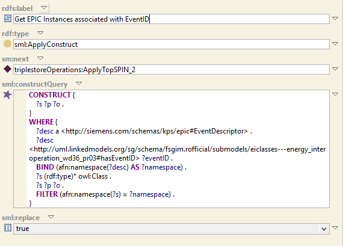


_Figure 18. Definition of CONSTRUCT statement to Filter Instances that are associated with a specific EventID - (filter by namespace convention)_

The “filtered” EPIC RDF triples are then handed to the “Map EPIC to OpenADR ” module that uses the epic2oadr.ttl SPINMap™ specification file to map the EPIC triples to OpenADR triples, following exactly the same procedure/options are described previously in “Map OpenADR to EPIC instances” module.

The final step of the script involves converting the newly defined instances to XML which is accomplished using the “Convert RDF to OpenADR XML” module via Semantic XML (Figure 19).


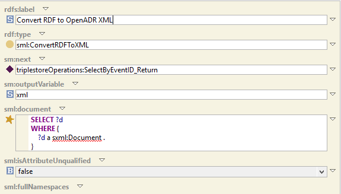


_Figure 19. Specify the sxml:Document to be used_


<table>
  <tr>
   <td colspan="2" ><strong>triplestoreOperations:SelectByEventID</strong>
   </td>
  </tr>
  <tr>
   <td><p style="text-align: right">
<strong>Description</strong></p>

   </td>
   <td>Returns the OpenADR XML DistributeEvent message distinguished by the eventID attribute. 
   </td>
  </tr>
  <tr>
   <td><p style="text-align: right">
<strong>URL</strong></p>

   </td>
   <td>http://localhost:8083/tbl/sparqlmotion?&id=triplestoreOperations:SelectByEventID&eventID=[eventID]
   </td>
  </tr>
  <tr>
   <td><p style="text-align: right">
<strong>Method</strong></p>

   </td>
   <td>GET
   </td>
  </tr>
  <tr>
   <td><p style="text-align: right">
<strong>URL/ Data Parameters</strong></p>

   </td>
   <td><strong>Required:</strong>
<ul>

<li>  id = triplestoreOperations SelectByEventID

<li> eventID = [the eventide associated with a specific Event]

<p>
 
<p>
<strong>Optional:  NONE</strong>
<p>
 
</li>
</ul>
   </td>
  </tr>
  <tr>
   <td><p style="text-align: right">
<strong>Success Response</strong></p>

   </td>
   <td>Code: 200 OK
<p>
Content: The XML represented as a String in OpenADR format
   </td>
  </tr>
  <tr>
   <td><p style="text-align: right">
<strong>Error Response</strong></p>

   </td>
   <td>Code: 404 
<p>
Content: Problem accessing /tbl/sparqlmotion -> Check URL Parameters
   </td>
  </tr>
  <tr>
   <td><p style="text-align: right">
<strong>Sample Call</strong></p>

   </td>
   <td>curl -X GET \
<p>
  'http://localhost:8083/tbl/sparqlmotion?=&id=triplestoreOperations%3ASelectByEventID&eventID=TEST_2' \
<p>
  -H 'cache-control: no-cache' \
<p>
  -H 'content-type: application/x-www-form-urlencoded' 
<p>
 
<p>
A fully functional example can be found<a href="https://drive.google.com/open?id=0BxxrPPAUmmuGU0M5U1FxczNUTnM"> here</a>
   </td>
  </tr>
</table>


### Postman Tool

Postman is a powerful HTTP client which provides a simple GUI to make requests to the RESTful APIs. It is strongly recommended to install Postman in order to test the web service endpoints from external tools rather than from within TBC-ME debug panel. For instructions on how to install the Chrome Extension, you can refer to this [video](https://www.youtube.com/watch?list=PLM-7VG-sgbtD8qBnGeQM5nvlpqB_ktaLZ&v=8veXJ9YGlFI).


# References


1. J. Koh, S. Ray and J. Hodges, "Information Mediator for Demand Response in Electrical Grids and Buildings," _2017 IEEE 11th International Conference on Semantic Computing (ICSC)_, San Diego, CA, 2017, pp. 73-76. doi: 10.1109/ICSC.2017.26 [[link](https://jbkoh.github.io/pdf/icsc2017_jbkoh.pdf)]
2. J.Hodges, S.Ray,  and K.Garcia,  “EPIC Project Technical Specification.” _Siemens internal document_. April 2017.


